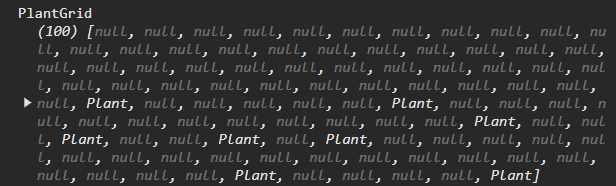

# Devlog Entry - [11/13/2024]

## Introducing the Team

### Tool Lead: Aiven Jerel Desiderio

This person will research alternative tools, identify good ones, and help every other team member set them up on their own machine in the best configuration for your project. This person might also establish your team’s coding style guidelines and help peers set up auto-formatting systems. This person should provide support for systems like source control and automated deployment (if appropriate to your team’s approach).

### Engine Lead: Nhat Thai

This person will research alternative engines, get buy-in from teammates on the choice, and teach peers how to use it if it is new to them. This might involve making small code examples outside of the main game project to teach others. The Engine Lead should also establish standards for which kinds of code should be organized into which folders of the project. They should try to propose software designs that insulate the rest of the team from many details of the underlying engine.

### Design Lead: Yazmyn Sims

This person will be responsible for setting the creative direction of the project, and establishing the look and feel of the game. They might make small art or code samples for others to help them contribute and maintain game content. Where the project might involve a domain-specific language, the Design Lead (who is still an engineer in this class) will lead the discussion as to what primitive elements the language needs to provide.

## Tools and Materials

### What engines, libraries, frameworks, and platforms will be used?

We plan to start with the Phaser.js v3.86.0 library in either the Node.js or Vite frameworks. The development will be handled in the Visual Studio Code IDE and the game will run in the browser so that it can easily transfer over to Mobile and PC platforms as well as various Operating System platforms. At the start, we will write the game code in TypeScript version 5.6 but later we will transition to JavaScript version ES2023 and/or Phaser.js v3.60.0.

One of our teammates is familiar with Node.js and Vite and everyone is familiar with Visual Studio Code. Phaser works best with JS and JS-like languages. Typescript being nearly identical to JavaScript is why we picked this language; we can easily switch our TypeScript code into assuming we programmed with fluidity and change in mind.

### Which tools do we expect to use in the process of authoring our project?

We expect to use generic useful version control tools such as Git and Github. Along with that the Visual Studio Code IDE to program our game in. Phaser is our other tool, and we plan on researching and looking into Phaser 3D to create a 3D interpretation for our game assignment. Within the IDE the tools lead will look into different extensions we could use and coding style practices to help format and keep our program orderly.

## Outlook

### Give us a short section on your outlook on the project. You might cover one or more of these topics:

We want to try to publish and monetize the game once we finish it rather than just throwing it into a GitHub portfolio. We also want to push the boundaries of Phaser to create a 2.5D game. Phaser is a primarily 2D engine, having said, attempting to create a 3D-like game using Phaser will be a fun challenge that we are hoping to take on.

### What do you anticipate being the hardest or riskiest part of the project?

We think that switching platforms or languages mid-way through the project could be challenging. Even though we know that the languages, platforms and frameworks we selected can work together, we don’t know how seamlessly that transition can be made until it’s time to make it. It could become a very long and tedious task. We’re also concerned about not knowing the requirements in advance. It could lead to us adding unnecessary things that we need to remove later, or not adding enough support that we now need to hurry to add. Finally, a big challenge would be pushing the boundaries of phaser. Since phaser is primarily used with 2D games, we worry about the lack of documentation or resources for this type of project.

### What are you hoping to learn by approaching the project with the tools and materials you selected above?

By using Phaser as a game library, we are hoping to create something fun and unique as well a
familiarize ourselves with the tool.

# Devlog Entry 0 - [11/29/2024]

## How we Satisfied the Software Requirements

### F0.a You control a character moving over a 2D grid.

We implemented a playable character that the player can control using WASD on the keyboard. The playable character has idle and moving animation for each directional idle and movement. Alongside that, there is also a 2D grid map of a farm with a plot of land where the player can plant stuff.

### F0.b You advance time manually in the turn-based simulation.

We advance the time by allowing the character to click on a house and go to sleep. When you choose to sleep, the Day value goes up by one so we advance through time by Days.

### F0.c You can reap or sow plants on grid cells only when you are near them.

The player is able to plant the seed when they are hovering over a tile that the player is standing and it doesn't already have a plant there. For the time being, the plants are randomly picked (from 3 choices: corn, eggplant, tomato) upon the player pressing "E".When you click on a plant a popup will show the plant's stats and give you the option to harvest or water it.

### F0.d Grid cells have sun and water levels. The incoming sun and water for each cell are somehow randomly generated each turn. Sun energy cannot be stored in a cell (it is used immediately or lost) while water moisture can be slowly accumulated over several turns.

The water level that the plant requires to level up is randomized between 25 and 100 with each day the water level will decrease by 5. The player can water each plant and increase the water level by 25 every time.

### F0.e Each plant on the grid has a distinct type (e.g. one of 3 species) and a growth level (e.g. “level 1”, “level 2”, “level 3”).

We found some plant assets of three different plants all at different stages of growth to visually show the different levels.

### F0.f Simple spatial rules govern plant growth based on sun, water, and nearby plants (growth is unlocked by satisfying conditions).

When you click on the plant you can see the stats of the plant (sun, water, and nearby plants).
If these conditions are satisfied the plant will level/grow the next day/turn. The plant matures and is able to harvest at level 3.

### F0.g A play scenario is completed when some condition is satisfied (e.g. at least X plants at growth level Y or above).

For now, we have implemented it so that if the player can grow a plant to the maximum level and harvest it, they have achieved the goal of the game. Hopefully, soon, we will be able to get our inventory system to a functioning state and the players get to pick and choose what they want to plant and we will change the requirements for leveling to be more plant specific.

## Reflection

We thought a lot in advance about making this assignment as easy as possible to manipulate given the changing requirements. It's a big reason we went with JavaScript and Phaser. We implemented Tiled into the idea because it came with a built-in grid system for us to just borrow from, however at first we had forgotten how to use Tiled. It took a while to get into the swing of things again but I don't think we need to change anything.
If we were to change something I would say that the assets we used in Tiled are so pretty and detailed that I think it made us focus on things that we really didn't need to focus on immediately. For example, we have a functional walking and idle animation working which was something we didn't need for the requirements but it was something we got distracted by because it was there. I think if we were going to change something it would be our scope so that we hone in more on what's required rather than additional features.
I also think we should change up how tasks are divided. Sometimes we will pick tasks at random only to find out that one of us can't do any of our tasks right away because our task depends on someone else in the group completing their task first. We should think through how we organize our team effort a little more, but as for the environment and tools we're working with, we have gotten a lot more comfortable with them now.

# Devlog Entry 1- [12/8/2024]

## How we Satisfied the Software Requirements

### F0 Requirements.

Same as last week

### F1.a The important state of your game's grid must be backed by a single contiguous byte array in AoS or SoA format. If your game stores the grid state in multiple formats, the byte array format must be the primary format (i.e. other formats are decoded from it as needed).

The primary gameplay happens on a plot of land where the player can plant seeds and interact with the plants. That being said, the data on that plot of land is recorded and kept in a simple array that can be manipulated. The array stores information on each of the plants(AoS) in it which is a structure that carries all properties of a plant. 

### F1.b The player must be able to manually save their progress in the game. This must allow them to load state and continue playing another day (i.e. after quitting the game app). The player must be able to manage multiple save files/slots.

I implemented the save functionality with the save button and the save slots with a pause button that uses a popup and there will be 3 save slots for you to choose from. Adding the ability to save across sessions was simple using the local storage I had keys stored in the browser’s localStorage updated as actions were taken to save data in the case of a sudden closing of the browser. When the program is reinitialized we then check each key if it has any data and if it does it loads up the last saved data in the new session. I utilized the local storage saving mechanic and separated its storage ability by slots. This made it so that whatever happens/is stored in one slot has no effect on what’s going on in the other slots. Unfortunately, the plant sprites wouldn’t save after a refresh and I could not figure out how to do this

### F1.c The game must implement an implicit auto-save system to support recovery from unexpected quits. (For example, when the game is launched, if an auto-save entry is present, the game might ask the player "Do you want to continue where you left off?" The auto-save entry might or might not be visible among the list of manual save entries available for the player to load as part of F1.b.)

We implemented the autosave by making the game save after planting and sleeping. The player will think there’s some autosave going on when the game is being saved every time they do a major action.

### F1.d The player must be able to undo every major choice (all the way back to the start of play), even from a saved game. They should be able to redo (undo undo operations) multiple times.

We implemented this using the undo and redo buttons. We stored all the actions in an undo or redo stack and also in memory once the action was made. If the player wanted to undo an action they would pull the action from the undo so they knew which action to undo and they’d pull the information about that action from memory so the game knew exactly how the undo should be executed. The same was done for redo. The planting of plants for some reason could not be undone. We were able to figure this out before but lost the functionality along the way. Every other action can be undone and redone though.

## Reflection

During our time working on F1, I think our plan of action really shifted. Before we each chose a task, worked on it and submitted it but here it got to the point where a task would pass through all of our desks before it was completed because someone was able to get it partially functional before getting stuck and someone else got it a little bit closer to completion and this would continue until the task was completed. We believe we made a good choice with tools and materials but I think that we should have recruited more qualified teammates. It was a lot to do for only three people. Since the player feedback thing wasn’t in the F Requirements pages, we didn’t think about it at all and only just realized it was a requirement in the first place. I think it should have been written in the F requirements pages because we spent a lot of time looking at those requirements and trying to implement them and only found out about the player feedback requirement when we went to write up our dev log afterward.

# Devlog Entry 2- [12/8/2024]

## How we Satisfied the Software Requirements

### F0-1 Requirements

Same as last week. No major changes were made

### F2.a External DSL for scenario designs: In separate text files or text blocks, designers should be able to express the design of different gameplay scenarios, e.g. starting conditions, weather randomization policy, and victory conditions. The language must be able to schedule unique events that happen at specific times. (Think about how you could define a level progression by putting the details specific to each level in a separate text file or one big file describing the progression as a sequence.)

There is a YAML file (externalDSL.yaml) that lays out the setup for the game, including the map, its tilesets and layers, and the player properties. The file’s content can be changed to add different layers or objects to the game(given that map.json supports it) as well as change the player’s properties.

### F2.b Internal DSL for plant types and growth conditions: Within the main programming language used for the rest of your game, you should implement and use a domain-specific language for defining your different types of plants and the unique growth rules that apply to each. (Think about how you could add and remove item types from your D1 code by pushing/popping items from an array or how you could create new types of stickers at runtime in D2.)

We implemented our internal DSL by using the same logic we used to create new stickers or add and remove items in other projects. By simply calling a function to create a new plant we can pass on the information needed to process and create a plant meeting certain requirements stated by us to grow. This allows for readability and the ability to create new plants in our array of available plants without having to program more as long as we have the assets to provide.

### F2.c Switch to an alternate platform: Change either your project's primary programming language or your primary user interface library/engine/framework. As more of your design is expressed in DSLs, your design becomes increasingly insulated from changes to your primary programming language or engine. Using your earlier implementation as a reference, it becomes more realistic that you'd be able to leverage generative AI for the large but mostly mindless translations from one language or engine to another.

### Reflection

# Devlog Entry 3- [12/8/2024]

## How we Satisfied the Software Requirements

### F0-2 Requirements.

Same as last week. No major changes were made

### F3.a

We implemented the language requirement by making all the visible text a variable that can be easily changed. We have a file called localization.js in which we define the words in English but if you wanted to you could write those terms in French or Spanish and set the language to French or Spanish and all those variables will be updated accordingly.

### F3.b

### F3.c

### F3.d

## Reflection

I think if we had actually successfully implemented it into a mobile game we would have had to go back and change the controls to match. Right now the game works with clicks and key presses and when on mobile, the game doesn’t function at all because of those limits. We believe we made a good choice with tools and materials but I think that we should have recruited more qualified teammates. It was a lot to do for only three people. The game didn’t evolve much because we didn’t complete F3 but we did add a lot more popups for player feedback purposes as the game progressed.

